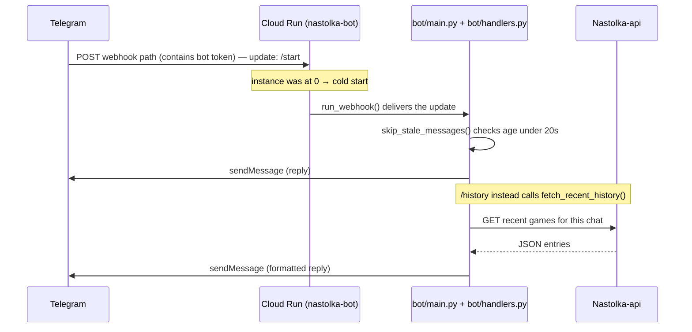
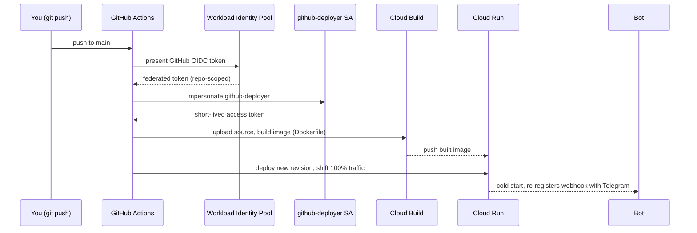
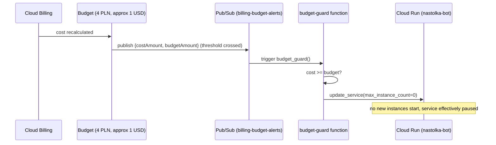

# How it works

Three independent things happen in this system, on three different timescales: a Telegram
message gets answered (milliseconds to seconds), a push to `main` becomes a live deploy
(about a minute), and — hopefully never — a runaway bill gets shut off (hours). Each is
drawn below as a marble diagram: one horizontal line per actor, time flowing left to right,
`●` marking something happening.

## 1. A message getting answered

The bot runs on [Cloud Run](https://cloud.google.com/run) with `--min-instances 0`, so it
scales to zero when idle — no container, no cost — and starts one on demand.

```
Telegram    ──────●───────────────────────────────●──────────────────►
                 /start                          /help
                  │                                │
Cloud Run   ......│●━━━━━━━━━━━━━━━━━━━━━●.........│●─────────────────►
  instance        │  cold start (~5-8s)   idle→0    │ (already warm,
                  │                                 │  no cold start)
                  ▼                                 ▼
bot process  (booting: connect to Telegram,     (running, replies
              register commands, setWebhook)     immediately)
```

- `●` on the **Telegram** line = an update Telegram POSTs to the bot's webhook URL.
- `━━━` on the **Cloud Run instance** line = a container is up and serving.
- `.....` = scaled to zero — nothing running, nothing billed.

Sequence for a single `/start`, in more detail:



**Why `MAX_MESSAGE_AGE_SECONDS = 20`:** the [`skip_stale_messages`](../bot/handlers.py)
decorator drops any update older than that. It exists so that if the bot has been down for a
while, Telegram's replayed backlog of queued updates doesn't all get answered at once — but
20s also comfortably covers a normal cold start, so a real user's first message after idle
time still gets a reply.

## 2. A push to `main` becoming a live deploy

```
git push main   ──●──────────────────────────────────────────────►
                   │
GitHub Actions  ...│●━━━━━━━━━━━━━━━━━━━━━━━━━━━━━━━━━━●...........►
                    │  auth (WIF) → upload source → Cloud Build →
                    │  deploy new revision              │
                    ▼                                    ▼
Cloud Run                                          new revision serving
                                                    100% of traffic
```



No long-lived key ever leaves Google Cloud — [`.github/workflows/deploy.yml`](../.github/workflows/deploy.yml)
authenticates via [Workload Identity Federation](https://cloud.google.com/iam/docs/workload-identity-federation):
GitHub's own OIDC token is exchanged for permission to impersonate `github-deployer`, and that
exchange only works for pushes from `a1exymoroz/Nastolka-telegram` (enforced by the identity
pool's attribute condition), so no other repo can trigger a deploy with it.

## 3. The spend safety net

Independent of everything above — this doesn't touch the deploy flow or the bot process at all.

```
GCP billing   ──────────────────────●───────────────────────────────►
  (spend)                     crosses 4 PLN (~$1)
                                     │
Pub/Sub       ......................●......................► topic: billing-budget-alerts
                                     │
budget-guard  ......................●━━━━━━━━━►........................►
  function                          │  reads cost vs budget,
                                    │  patches Cloud Run service
                                    ▼
Cloud Run                    max-instances → 0
                              (service halts; nothing else touched)
```



This only touches `nastolka-bot`'s max instance count — not the GCP project, not billing
itself, not the other infra (secrets, budget, function all keep running). To turn the bot back
on after investigating a spend spike:

```bash
gcloud run services update nastolka-bot --region us-central1 --max-instances=1
```

## Where things live

| Concern | Where |
|---|---|
| Bot code | [`bot/`](../bot/) |
| Container build | [`Dockerfile`](../Dockerfile), [`.dockerignore`](../.dockerignore) |
| Deploy workflow | [`.github/workflows/deploy.yml`](../.github/workflows/deploy.yml) |
| Manual deploy steps, env vars | [`README.md`](../README.md) |
| Secrets | GCP Secret Manager (`telegram-bot-token`, `telegram-bot-secret`, `telegram-webhook-secret`) — not in this repo |
| Budget + auto-stop function | GCP project `nastolka-bot` (Billing Budgets, Pub/Sub, Cloud Functions) — not in this repo |
